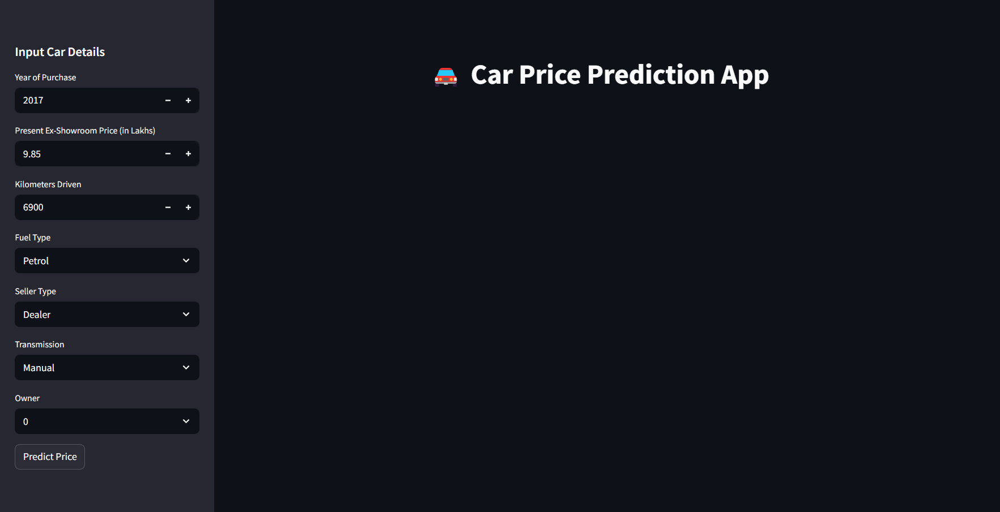
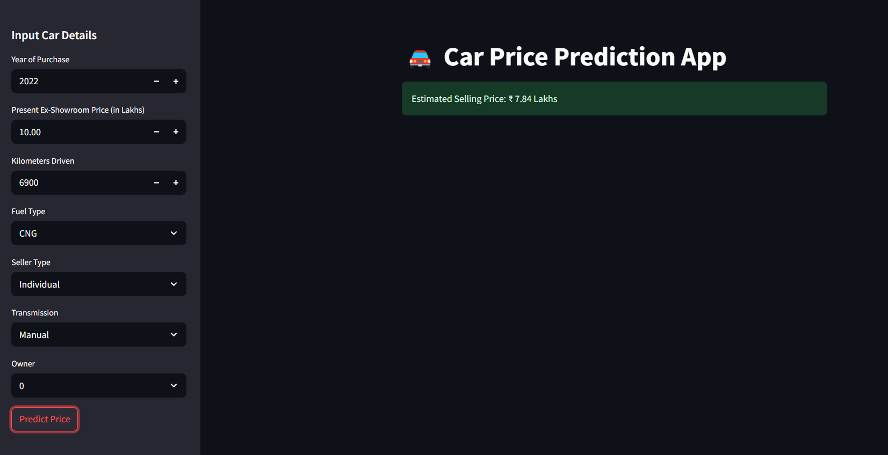

# Car Price Prediction 📊🚗

A machine learning project to predict car selling prices based on various features like year, present price, kms driven, fuel type, etc.

## Technologies:
- Python
- Pandas, NumPy, Matplotlib, Seaborn
- Scikit-learn
- Streamlit (for web app)
- RandomForestRegressor
- Pickle (for model saving)

### 📍 Homepage  

### 📍 Predicted Price Result  

## Author
Arin Talavadekar
 
